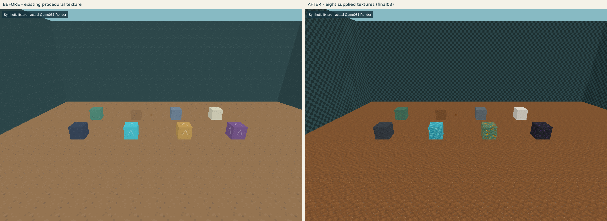
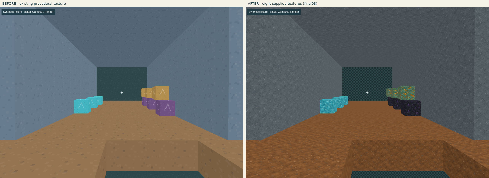
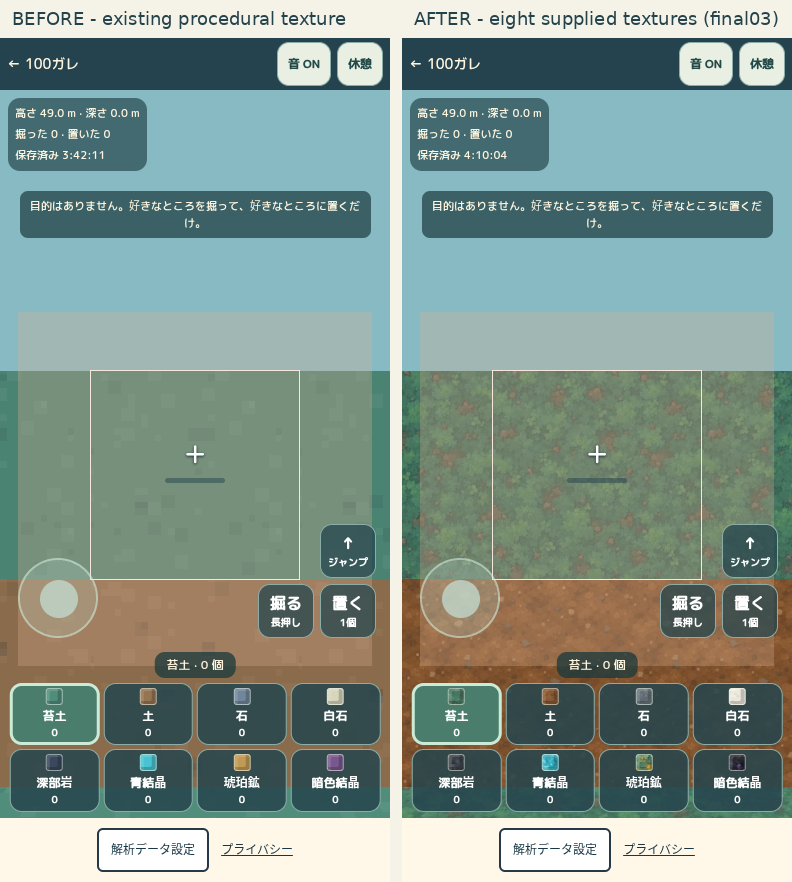

# Game031 A案・提供8素材のテクスチャ更新

2026-10-08。**実装・ローカル技術QA完了、公開確認前。公開完了は末尾の公開記録を参照。** 対象は既存Game031、名称「掘って、置くだけ。 / DIG & PLACE」。新作や候補表の消化ではない。基準main `2d745110e1a7a24660da16dd6529d8ca2d08a2bf`、専用worktree/branchで他15作業treeとGame018を保全。

## 8素材の対応と出典

ユーザーのZIPで受領した8画像を全て使う。原本はいずれも1254×1254・RGB PNG・透過なし。全体をLANCZOS縮小しWebP quality90/method6、標準512×512／軽量256×256へ変換。加工画像も原本の方向・内容を維持し、切り抜き・回転・シーム補正・追加PBRマップは行っていない。各素材の3×3反復と縮小/圧縮を実viewして採用。完全シームレス、実測PBR、第三者権利ゼロの保証はしない。

| ID | 名称 | 実際の元ファイル | 配信名（標準/軽量共通） | bytes 標準 / 軽量 |
|---|---|---|---|---|
| 1 | 苔土 | `ChatGPT 画像 2026年10月8日 11_10_14-1.png` | `moss_soil.webp` | 50288 / 16194 |
| 2 | 土 | `ChatGPT 画像 2026年10月8日 11_10_16-2.png` | `earth.webp` | 31334 / 11374 |
| 3 | 石 | `ChatGPT 画像 2026年10月8日 11_10_18-3.png` | `stone.webp` | 46208 / 12688 |
| 4 | 白石 | `ChatGPT 画像 2026年10月8日 11_10_20-4.png` | `chalk.webp` | 40896 / 10758 |
| 5 | 深部岩 | `ChatGPT 画像 2026年10月8日 11_10_22-5.png` | `deep_stone.webp` | 11582 / 5186 |
| 6 | 青結晶 | `ChatGPT 画像 2026年10月8日 11_10_23-6.png` | `blue_crystal.webp` | 68666 / 20236 |
| 7 | 琥珀鉱 | `ChatGPT 画像 2026年10月8日 11_10_25-7.png` | `amber_ore.webp` | 71258 / 22762 |
| 8 | 暗色結晶 | `ChatGPT 画像 2026年10月8日 11_10_34-8.png` | `dark_crystal.webp` | 40516 / 12922 |

配信先は`/assets/game031/textures-a/v1/{standard|light}/`。各原本・加工・公開SHAと寸法は[採用台帳](../../../../assets/game031/textures-a/v1/source-index.json)、由来と権利の確認範囲は[素材記録](SOURCE_ASSETS.md)。原本は`assets/`で保全し`public/`へ置かない。通常CIは確定WebPだけで動き、ユーザーWindowsフォルダへ依存しない。新しい外部素材やImageGenは利用していない。AIR0は空気、境界9は独自の格子面であり暗色結晶8を流用しない。

## 表示の実装

- 新`SurfaceTextures.ts`で8画像を同時に検証・decode。WebGL2の`DataArrayTexture`10layer（0/1〜8/9）を共有し、1Chunk/1Materialの露出面描画を維持。各面1画像分、平坦法線とBlockID layerをGeometryへ明示。画像間を跨がないlayerごとのmipmapで遠景の素材色混入を防ぐ。6方向は固定fixtureと属性値で確認した。
- 標準は`MeshLambertMaterial`＋環境光/方向光。軽量は`MeshBasicMaterial`＋灰色の面陰影。白いbase color、標準は旧vertex陰影を重ねず、BaseColorはsRGB、renderer出力もsRGB。凹凸/金属度/透明/発光/影/SSAO等の新mapや描画パスは作っていない。
- 拡大Linear、縮小LinearMipmapNearest（選択したmip内はbilinear、mipchainは有効）。異方性は標準2／軽量1を端末上限以内で使用。最初のPBR/trilinear案の負荷を実測してから、この設定へ変更した。遠景filterを全面無効化したりNearest拡大へ戻していない。
- ホットバーは同じdecode済み画像から48px見本を作り、日本語名/数/選択状態を維持。原本の追加ロードや各枠のWebGLRendererは作らない。
- 8枚が全て正常なときだけatomicに交換。品質変更の旧jobをepoch/Abortで無効化し、破棄Textureを解放。8秒の読込上限、404/decode失敗時は前の正常素材または明示した簡易表示を維持。設定画面に状態を表示し、`#app`のsurfaceStatus/Count/Tierで成功とfallbackを区別する。
- 白石上の採掘枠は暗い色、深部岩/暗色結晶のヒビは淡い金色に調整。採掘時間・進行・配置判定・粒子数/寿命は変えていない。

Three.js版は既存0.186.1を維持。現環境ではthreejs.orgのネットワーク許可が確認できず、正規インストール済み公式sourceのDataArrayTexture/WebGLTextures/sRGB/Materialと照合した。[独立ソース照合](QA/INDEPENDENT_SOURCE_AND_TESTS.json)。

## 実画像と比較

[同条件・最終版の比較一覧](QA/comparison-final03/INDEX.json)。左が変更前、右が採用した最終設定。gallery/tunnelは隔離した32³の表示fixture、actual-gameは通常の起動操作による128×64×128世界。fixtureを自然到達や本番ユーザーの成果と混同しない。

[最終37画面](QA/after/run-20261008T-candidate-03/REPORT.json)／[採掘・配置8画面](QA/after/overlays-03/REPORT.json)。PC1280×900、phone390×844、320×568、横844×390。8素材/境界/3×3壁/6面/地下/ホットバー/白石と暗色結晶の進行ヒビ/有効無効プレビューを実view。斜め床の90keyframeずつとMP4は[動き証拠](QA/after/oblique-motion-01/REPORT.json)。12fpsは証拠動画の編集速度で、実ゲームFPSではない。静止keyframeの独立レビューは連続動画の人間のちらつき/酔い評価を代行しない。

独立AI Visual84/100、F14/15・H12/15。[判定と見た画像](QA/INDEPENDENT_VISUAL_FINAL.json)。作者本人の面白さ・実機の触感/音/発熱/酔いは未実施。

## 性能と対策

Chromium headless + ANGLE SwiftShaderソフトウェアGPU、1280×900、同世界/姿勢/所持、dirty0後120frameを順次測定。実機PC GPUやiPhone/Androidの性能保証ではない。

| 品質 | 中央値ms 旧→最終 | p95ms 旧→最終 | draw calls | triangles | 共有Texture |
|---|---|---|---|---|---|
| 標準 | 23.60 → 27.80 | 44.90 → 51.90 | 24 → 24 | 9,866 → 9,866 | 最終1 |
| 軽量 | 22.35 → 24.20 | 41.80 → 53.60 | 17 → 17 | 5,644 → 5,644 | 最終1 |

[一致条件と120frame全記録](QA/after/performance-actual-120-03/REPORT.json)。標準+4.2ms（約18%）、軽量+1.85ms（約8%）の残コストがある。初期PBR案は標準24.75→76.2ms、軽量23.75→44.95msだった。Lambert/Basic、異方性2/1、mip内bilinearへの変更で削減し、遠景や素材の判読性を再確認した。初期/中間測定は[01](QA/after/performance-actual-120-01/REPORT.json)/[02](QA/after/performance-actual-120-02/REPORT.json)へ保全。

初回画像転送は標準8枚360,748B、軽量8枚112,120B（通常は片方のみ、画質を切り替えると他方も取得）。公開metadata4,883Bは画像とは別。Game031 runtime bundleは公開前版566,611B→576,560B（+9,949B）、ローカルgzip推定147,576B→150,296B（+2,720B）。実CDNの転送符号化/サイト全体初回量ではない。[JS差分](QA/BUNDLE_TRANSFER_COMPARISON.json)。GPUはRGBA8・10layer・mip含む概算標準13.33MiB／軽量3.33MiB。ドライバ内部/CPUdecode/切替の一時二重保持は含まない。[配信容量の計測](QA/asset-budget.json)。画像縮小とWebP転送削減をGPU圧縮と混同しない。

[最終lifecycle試験](QA/after/lifecycle-02/REPORT.json)で全8layerのdecodepixel一致、6面法線/UV、12回品質切替＋80回編集でTexture1/Geometry一定、404/decode/stale/destroy-lateを検証。繰り返し編集で解放漏れを確認せず。

## 操作・保存・失敗の記録

`npm run check` PASS、全831tests/72files PASS、`npm run build` PASS、offline Jev helper25 PASS。[実行ログ](QA/final-checks-01/)。新しい素材状態の日本語は現行フォントで欠落0。初回全体テストは830PASS/1FAILで、manifestの素材出典だけ更新してJev exportのcurrentManifestが旧文言だったため、同じGame031のrights1fieldだけ同期後に全体再実行した。単純JSON一致確認はJev対象外。

旧表示版で通常3採掘/1配置した合成保存コピーを新表示で復元し、全4差分セル・所持・統計を維持。[旧セーブ](QA/before/old-save-01/REPORT.json)/[新表示で復元](QA/after/old-save-01/REPORT.json)。ユーザーの保存を試験のために初期化していない。

通常入力で104採掘/50配置を達成（導入4採掘＋計画100採掘/50配置）。横穴/足元落下/帰還/段差ジャンプ/素材切替/Pause→保存してタイトル→再読込で所持と統計を維持した。[最終通常操作](QA/after/normal-100-50-03/REPORT.json)。最初の足元落下試験は、固定時間の歩行で帰還台を抜け切れず、次の試験も身体幅計算を.299として隣接土を見落とした。失敗画像/状態を先に保全し、独立した純物理再現で残った土が身体を支えていることを確認した。試験の計画だけを修正し、Physics/Engine/Worldは変更していない。[初回](QA/after/normal-100-50-01/REPORT.json)/[再試験の失敗](QA/after/normal-100-50-02/REPORT.json)/[独立再現](QA/after/normal-100-50-02/BLIND_SUPPORT_PROOF.json)。cube下面撮影の床遮蔽・QAラベル重なり・短すぎたframe配列の集計失敗も原本を保全し、成功だけに置き換えていない。

[変更範囲の監査](QA/SCOPE_AUDIT.json)：World/Blocks/Types/Input/Engine/Physics/Save、世界X128/Y64/Z128、seed/gen/save/block版1、旧差分/所持/バックアップ/採掘時間/移動/ジャンプ/衝突/帰還不変。他203ゲームsource、広告/GA4/CREDIT OFF、解析同意/送信停止、Worker/D1/認証/依存/公式workflow不変。presentation_versionだけ`textures-a-v1`、rules_version1を維持。Catalog active30/historical31、次032は未着手。

実際の通常操作画面（本番相当11採掘/5配置）からGame031だけのPortal thumbnailを640×360へ更新した。平面素材一覧や合成世界は使用していない。[採用記録](QA/THUMBNAIL_UPDATE.json)。

[独立技術レビュー](QA/INDEPENDENT_TECHNICAL_GAMEPLAY_FINAL.json)は、PC/phoneの通常操作記録・実画像とテストソースを別担当が照合したもの。レビュー担当が自らlive操作した証拠ではない。スマホ相当10採掘/5配置、move/look/DIG3指・cancel/lostcapture・素材との役割競合・2197voxelhash再読込一致・任意練習1/1と本番の分離・390/844/320表示を確認した。[スマホQA](QA/after/mobile-10-5-01/REPORT.json)。本番相当ビルドにはDEV診断なし、両品質の16WebP実読込、通常11/5、公式UI旧保存取込で差分/所持/統計の一致とその後の通常操作/再保存を確認した。[preview](QA/after/production-preview-desktop-01/REPORT.json)/[旧保存preview](QA/after/production-preview-old-save-01/REPORT.json)。これは公開URLの証拠ではない。

[実際のUI異常系](QA/after/fallback-ui-02/REPORT.json)で初回404/切替decode失敗の明示警告、通常1採掘と保存→reloadの地形/所持維持を確認。初回試験は「再開」完全一致selectorで既存「再開（ドラッグ視点）」に届かずtimeoutしたため、失敗画像を保全しJev Shadow後に試験だけ修正した。[失敗](QA/after/fallback-ui-01/REPORT.json)。[PC platform](QA/after/input-platform-01/REPORT.json)は明示PointerLock→左ボタン採掘→Escape入力解除、contextloss→復旧の世界維持、画質切替のcanonical hash/所持維持、WebGL2不可時の保存保全とPortal導線を確認。画質lightの途中サンプルはloading中の旧standard8なので新light成功の証拠には使わず、lifecycle/capture03のsuppliedlight8を別に確認した。

## Jev

実findingに限りschema v2の4問を実APIへ送り、答えを伏せた独立レビューと比較した。QAラベル、cube撮影、足元落下試験、暗色ヒビ、初期負荷、足元再試験の新F観測が対象。再開selectorも対象。実API7回、全7行api_attempted=true / AVAILABLE / HTTP200 / resolved modelあり、28回答全て有効、独立7判断あり。原因一致4/7、次の証拠一致3/7、FALSE PASS0・RELEASE RISK MISS0（この少数サンプル内）。有効性の一般化やレビュー時間節約率の証明ではない。Jevは画像を直接見ておらず、実装・Visual・面白さ・公開可否を決めていない。HTTP200＋有効4回答＋実送信を行ごとに確認する[監査](QA/JEV_EXECUTION_AUDIT.json)/[集計](QA/JEV_SUMMARY.json)。単純HTTP/数/SHA/build/JSONは実API対象外。記録形式のadapterは元の独立判断を保持して別JSONに保存した。

## 公開状態と未確認

公開は技術QA完了後の既存公式Pages workflowで行う。現在は前版が公開中。期待commit、CI、全17新素材、JS/CSS/HTML/thumbnailの配信SHA、公開通常操作と旧保存の継続を別記録で確認後、この節へ追記する。

本人試遊、物理iPhone/Androidの親指操作/発熱/音、長時間の人間の感想は未実施。提供素材の元生成契約/権利履歴を独立に確認できていない。深部岩の粗い模様は原本の特徴。全端末快適、完全シームレス、PBR完全対応の保証はしない。公開承認は人間評価済みを意味しない。
