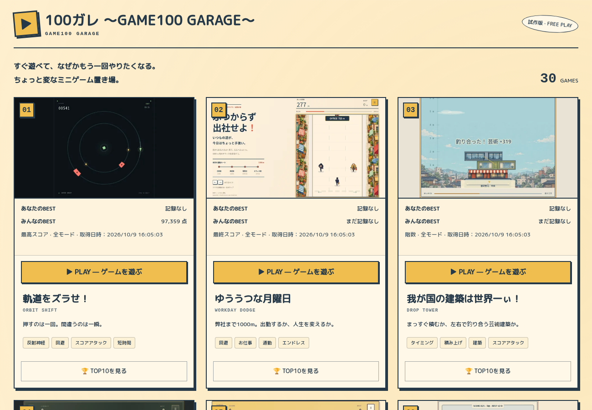
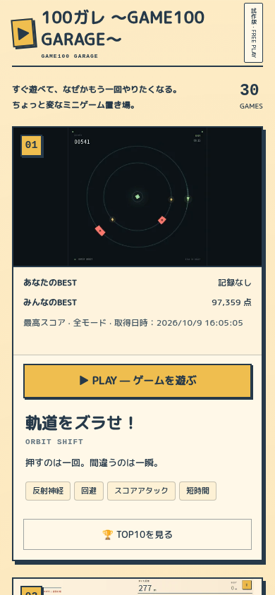

# PLAY優先・全ゲーム帰還ナビゲーション

2026-10-10 JST。基準main `cf06ae936b97fec591123bbf51bb6ff4817e349a`、専用branch `codex/portal-play-navigation`。active30作品（010退役を維持）。公開結果は末尾に記録する。

## 実装

カードはサムネイル→あなたのBEST／みんなのBEST→**黄色PLAY**→タイトル／英語タイトル／紹介／タグ→**クリーム色TOP10**。PLAYは `#EFBE4F`／48px以上、TOP10は44px以上・小さい文字・強い影なし。20競争作品だけTOP10を表示し、残り10作品に空枠を作らない。サムネイル／PLAY／紹介リンクとTOP10 buttonは兄弟要素。空白カードの既存クリック委譲、game_card_click／game_launch／impressionの計測経路を保持した。

帰還は全30作品で **← ゲーム一覧へ**、左上の通常フローヘッダー、44px以上、safe-areaを考慮。共通CSS／入力保護は `public/arcade-navigation.css`／`.js`、クラスは `arcade-game-header`／`arcade-portal-return`。各物理HTMLへ明示的に参照を追加し、ビルド時に全ページを無条件書換えするpluginは追加していない。001・002・004〜006・007〜009・011・015のonboardingと003のTowerTrainingが生成するリンクも共通クラスを使う。

007／008／011は既存anchorをヘッダー先頭へ移動、009はfooterのanchorをheaderへ移動、002 footerの `/` は相対一覧URLへ修正。001のブランドはゲーム内タイトルbuttonとして区別。必要な結果／メニュー補助リンクも同じ文言・クラス・URLに揃えた。ゲーム内タイトル／リトライ／練習終了は置換していない。[全作品変更前後表](GAME_NAVIGATION_MATRIX.md)。

ネイティブmodalではページheaderがinertになるため、開いているmodalのtop layerに元headerと同じ座標の帰還anchorを置く。26 native HTMLの `viewport-fit=cover` は `contain` に変更し、ブラウザー自身が切り欠きの内側にviewportを収める。100dvhで求める下部操作の高さも同じ安全なviewportを使い、headerだけをずらしてHUDが下に押し出される方法を避ける。共通headerにtop insetのnormal-flow marginも用意した。物理端末でのcutout実測は未実施。通常クリックは元anchorへ渡し、既存save／quit／telemetryを通す。modifierクリックは通常のリンク動作。全ゲームへの常時固定overlayは使わない。keyboard shortcutをwindow captureで隔離し、pointer開始はcapture検証後のdocument bubbleで隔離する。releaseはゲームのheld入力cleanupへ渡す。

012〜014は外側wrapperだけを変更。`tools/legacy-record-shells`を同期し、importerの再実行で同じ文言・クラス・共通asset参照が保たれる。各runtimeFiles／PCK／WASM／game.html／native record bridgeの値と実byteは基準mainと同一。shellFilesのサイズ／SHAだけを更新した。元のソースexport環境がないため再export／import実行による再検証はしていない。

031は既存の `leave()` を維持し、pause・入力停止・最新世界の保存待ち・失敗時の回復選択を通す。地上復帰とinventory／世界互換性も保持。019のfinish、018のquit、015のquit／音停止、他作品の既存終了処理も維持。Worker／D1／migration／記録定義／得点／ランキング計算／Analytics・広告・CREDIT設定を変更していない。

## 検証と修正記録

最終sourceは [FINAL_SOURCE_MANIFEST](QA/FINAL_SOURCE_MANIFEST.json) で固定。各検証の対象・fixture／実入力・未実施項目は各REPORTのprovenanceを参照。画面幅は1300×900、390×844、320×720、844×390。

- 全30作品×4画面幅＝120開始画面：帰還の44px高さ・画面内・header内・他header操作との重なり・実hitを測定。[layout-safe-final](QA/layout-safe-final/REPORT.json)。この後の変更はpointer開始／releaseの伝播と022／023／024／028 menu CSSとsafe viewport metadata。長い説明は [独立56case再確認](QA/explanation-narrow-accepted/REPORT.json)、変更4作品のtitle／説明／練習の最終compiled4幅は [48case確認](QA/menus-compiled-accepted/REPORT.json)を参照。
- TOP10既存118項目：空／10件／長い得点／同点・cache／失敗・stale／遅延応答・Esc／focus復帰・keyboard起動を合格。[ranking-accepted](QA/ranking-accepted/REPORT.json)。ランキング数値はローカルfixtureであり本番投稿ではない。
- 031 PC／touch：実採掘・配置、保存完了を遅らせた帰還、reload一致、世界／所持数を保った地上復帰、保存失敗で留まる→回復→Enter帰還の6シナリオ合格。[save031-release](QA/save031-release/REPORT.json)。保存delay／quota障害は明示的fixture。
- 全activeカードの順序・色・TOP10条件、実PLAY／サムネイル／紹介リンク、1回のlaunch／cardイベント、帰還、root／repository subpathは [portal-release](QA/portal-release/REPORT.json) に1,234check／例外0／POST0が合格（最後の022／023／024／028 menu CSSとsafe viewport metadata修正前のcompiled版。変更したmenuは再build後に別途確認）。
- PC／390pxの全作品の開始画面・説明・練習・開始操作後・利用可能なポーズ、click／tap／Enter帰還は [統合された実成功観測](QA/INTERACTION_ACCEPTED.json)（473check、292状態観測、30作品×2幅）。最初の [interaction-release](QA/interaction-release/REPORT.json) は022説明でFAILし、[mobile-completion](QA/interaction-mobile-completion/REPORT.json) は028説明でFAILした。修正後の成功を別REPORTとして保存し、元FAILを削除していない。021開始／pause／実帰還は4幅の [追加確認](QA/GAME021_START.json)。labelのafter-startは開始操作後の観測であり、全作品の終局完走とは異なる。
- Godot3作品のPC／touch通常操作・結果・retry・旧保存再読込・ポータルBEST・実帰還は [legacy-accepted](QA/legacy-accepted/REPORT.json)。native 014のreadonly観測付きURLを明示し、通常URLに診断を出さない確認を含む。
- 独立code／実画像レビューは [INDEPENDENT_REVIEW](INDEPENDENT_REVIEW.md)。単体群・check／buildは下の最終検証記録に記載。

初回の問題も残した。onboardingのtextContentを無条件更新するとMutationObserverが初期化を繰り返したため、変更時だけ更新する。021の320px／027の短横画面ではmenuがheaderを覆ったため、menuをheaderと既存footerの間に収める。最初のwindow capture pointer隔離は026／031のfresh gesture検証を止めて実クリック帰還を壊したため、capture検証を通すdocument bubbleへ変更し、release cleanupも遮断しないよう修正。022のスマホCSSでreturnがbrandの右に置かれていたためorderを先頭へ修正。022／028の390pxと023／024の320pxで長い説明が戻りを覆う追加findingも、作品別menu height budgetで修正した。初期portal／save031のFAILを削除せず、最終の実入力PASSと分けた。

テスト基盤の修正：Godot wrapper自身がindex.htmlなのでURL末尾だけの待機は到着確認にならない。正確なportal URLへ変更。旧leaderboard probeの「共有準備中」「ゲームセンターへ」期待は今回の本番接続／名称と合わないため、新しいnavigation probeで現行状態を検証。fixture用API endpointと配信用endpointを分けた。並列browser実行中の単体5件timeoutは原ログ [UNIT_TIMEOUT_INITIAL](QA/UNIT_TIMEOUT_INITIAL.log) に保存し、直列・testTimeout30000の再実行で887件／79file合格。015の明示20秒timeoutは上書きしない。テスト実装の閾値は変更していない。

Jev Shadowは実観測16件・64回答・HTTP200。通常の独立レビューを省略せず、最初の独立source reviewでもpointer blockerを見逃していた事実を記録した。rootリンク／028説明findingにrisk miss2。focus031のrisk判断はannotation後に独立reviewerが範囲を狭めたため、原ログを保持し [比較訂正](QA/JEV_COMPARISON_CORRECTION.json) に別記した。[Jev集計](QA/JEV_SUMMARY.json)。自動修正／公開gateには使っていない。

## 画像

ゲーム別の最終初期PC／390／320／横画面画像は `QA/layout-safe-final/`、練習modal画像は `QA/interaction-release/`。公開版画像は公開QAの出力へ保存する。

## 制約と人間確認

物理スマホ・本人試遊・音の聞こえ方・親指の誤タップ率／改善率は測定していない。全30作品のゲームルールを変更していないが、全作品の全終局・全練習成功・全特殊状態を今回もう一度完走したとはしない。各REPORTに実到達した範囲を記録する。オンライン共有資格作成／本番架空スコアPOSTは行わない。

001の320px titleで練習buttonの下29.078125pxがstage overflowに隠れる。元mainと今回の同条件比較で欠け量が同一だった既存制約。[BASELINE001](QA/BASELINE001.json)。今回の帰還anchorは表示／hitが正常。旧Godot元UIの縦画面・小文字制約とsoftware GPU性能は帰還wrapper変更では解消していない。歴史的migration監査は旧source checkout不在でそのまま実行できなかったため、現在のmanifest／runtime実byte／template比較と通常browser入力で代替した。

## 最終検証・公開

`npm run check`／本番records endpointによる `npm run build` が成功。単体 `npm test -- --maxWorkers=1 --no-file-parallelism --testTimeout=30000` は887tests／79files合格、offline Jev25tests合格。再現コマンドは [HANDOFF](HANDOFF.md)、原ログは [UNIT](QA/UNIT_ACCEPTED.log)／[CHECK](QA/CHECK_FINAL.log)／[BUILD](QA/BUILD_FINAL.log)／[OFFLINE_JEV](QA/OFFLINE_JEV.log)。buildの既存large chunk警告は残る。compiled menu probe初回は028のselectorを誤り8timeout／40PASS。正式IDのaliasに修正し、元 [FAIL](QA/menus-compiled/REPORT.json) を残した。

runtime commit [`08531b12`](https://github.com/Badgio0906/Badgio0906-web-mini-game-arcade/commit/08531b12e96457bf0109102fb3d41f3fac1533b8)、公式 [Pages run37954786879](https://github.com/Badgio0906/Badgio0906-web-mini-game-arcade/actions/runs/37954786879) のbuild／deployがsuccess。CIの通常 `npm test` も成功。公開URL [game100garage.com](https://game100garage.com/)、GitHub repository Pages URLも同domainへredirectしHTTP200。[URL確認](QA/PUBLIC_URLS.json)。

最初の配信照合はlocal referenceのビルド環境がCIと異なりgame001 asset hashで停止した。原 [FAIL](QA/public-version/FAIL.log)を保存。Actions Variables API readは利用できず、公開frontendの既存設定を確認するとGA4空／telemetry `/v1/events`有効だった。recordsだけ指定したbuild、およびGA4／telemetryを両方空にしたbuildは一致しない。既存公開値を明示した同SHAの [CI相当build](QA/BUILD_CI_REFERENCE.log) で、HTML／JS／CSS／font／Godot runtime／shell／共通navigationの166fileすべて実byte SHAが一致。[VERSION](QA/public-version-accepted/VERSION.json)。環境設定・製品sourceは変更していない。公式artifact ZIPそのものは取得せず、期待SHAの公式run成功＋clean同SHAの同設定build＋公開byteを照合した。

公開版の [実PLAY／帰還](QA/public-navigation/REPORT.json) は249check合格。PC／390pxで30作品すべてを黄色PLAYから実起動し、headerから正確なindex.htmlへ帰還した。320／844pxの代表操作と全card構造／色／TOP10条件も合格、POST0／例外0。公開 [live TOP10／BEST／共有設定](QA/public-ranking/REPORT.json) も132check合格。20boardの匿名GET・modal focus／Esc／閉じる・非共有個人BEST・任意共有初期OFF・参加資格未作成・広告設定・30thumbnail decode・通常001結果のlocal BEST帰還を確認。POST0／例外0。BEST読み込み完了後のPC／phone公開画像も保存した。結果状態の追加QAは [原44case](QA/result-states/REPORT.json)、[旧scroll回復12case](QA/result-states-recovery/REPORT.json)、[最終scroll修正12case](QA/result-states-accepted/REPORT.json) を分けた。11 native作品の42 unique結果viewで通常操作→実帰還を確認（002のphone／320px idle結果は26秒内に到達せず、残り16 native作品の結果はこのsuiteでは未試行。Godot3結果／031保存失敗は別QA）。原44は36PASS／2画面外FAIL／6未到達を保持。004の誤canvas selectorは通常digit入力へ直し、021／023の844pxではメニュー表示時に通常headerへ即時scroll復帰する限定修正を加えた。最終12caseはwheel操作なしでinitial hit／44px／実帰還が合格、元result focusも維持した。常時overlay／stickyは追加していない。

J／KのShadow送信前に独立reviewerが旧scroll回復probeを完了していた手順逸脱を [TIMING_DEVIATION](QA/JEV_TIMING_DEVIATION.json) に明記。runtime修正はShadow送信後。最初のTEST_INFRA判断も残し、initial viewport位置の要件を確認したPRODUCT_BUG判断を [独立follow-up](QA/independent-judgments/navigation-result-header-scroll-followup.json) として別記した。Jev比較はこの最終follow-upを用い、旧判断は書換えない。[公開証拠](QA/PUBLICATION.json)。

## 最終scroll修正版の公開

runtime [`79d89c0f`](https://github.com/Badgio0906/Badgio0906-web-mini-game-arcade/commit/79d89c0f164a09630c22dfa5b7c66f173aac3cdd)、公式 [Pages37958362072](https://github.com/Badgio0906/Badgio0906-web-mini-game-arcade/actions/runs/37958362072) のbuild／deployがsuccess（通常npm test／offline Jev／build成功）。新SHAの [166file配信SHA](QA/public-version-final/VERSION.json) がすべて一致。公開021／023の844px実touch操作から結果へ進み、wheelなしでinitial return hit／44px／元result focus維持／実tap帰還も2case合格。[公開結果](QA/public-results-accepted/REPORT.json)。普通のscript URLから取得したnavigation JS実body hashも両caseで新sourceと一致しており、qaクエリ付きbyte照合だけに依存していない。

最初のlive結果probeは既存180ms overlay／220ms turnの直後に入力して、023title開始が無効／021最初の一手が無効となった。原 [FAIL](QA/public-results-final/REPORT.json)を保存し、testのみ240msの通常待機を加えた。game gate／時計／modelを変更・bypassしていない。新SHAで全30作品の公開PLAY／帰還を再実行し249check／POST0／例外0合格。[最終公開ナビ](QA/public-navigation-final/REPORT.json)／[最終公開証拠](QA/PUBLICATION_FINAL.json)。Portal／ranking sourceは初回132caseの公開確認後も不変。

最終runtime79d89c0の配信・操作確認を完了し、残りはこの記録を保存する文書更新のみ。本人試遊・物理端末・音・全作品の全結果完走は未実施であり、自動QAから補完していない。
